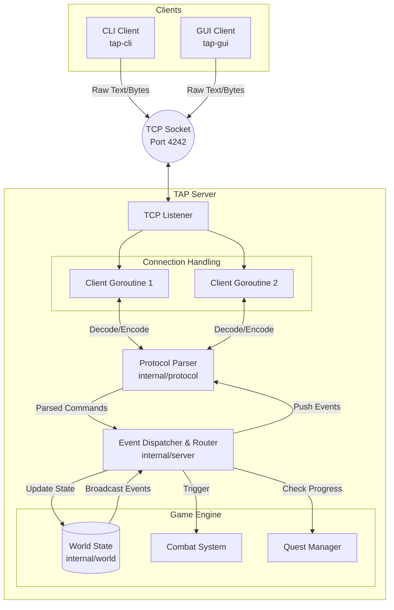

# Architecture

The Answer Protocol (TAP) is built around a robust client-server architecture written in Go, specifically designed to handle concurrent connections and real-time state synchronization over TCP. The core server acts as the single source of truth, employing an event-driven dispatcher to manage player actions, combat, and world state across a shared environment. By isolating responsibilities into distinct modules—such as protocol serialization, world management, and network I/O—the system remains highly maintainable and scalable. This backend seamlessly supports two independent client implementations: a fast, text-based CLI and a richer, interactive GUI.

## System Overview

The system is composed of three primary binaries, all compiled from a single monolithic repository:
1. **Server (`tap-server`)**: The authoritative game server.
2. **CLI Client (`tap-cli`)**: A lightweight, terminal-based interface.
3. **GUI Client (`tap-gui`)**: A graphical user interface offering enhanced accessibility.

### Architecture Diagram



## Server Design

### Language Choice: Why Go?
The project constraints permitted the use of C, C++, Rust, Go, or Zig (explicitly forbidding Python). We evaluated these options based on the requirements of building a highly concurrent, networked multiplayer server:

| Language | Pros | Cons | Evaluation |
| :--- | :--- | :--- | :--- |
| **C / C++** | Ultimate control over memory and system resources; industry standard for performance. | Extremely verbose for writing safe concurrent code; manual memory management increases the risk of segfaults and memory leaks; networking standard libraries are low-level. | Passed over due to the development overhead and safety risks associated with manual memory management in a highly concurrent environment. |
| **Rust** | Unmatched memory safety without a garbage collector; exceptional performance. | Steep learning curve and strict borrow checker can drastically slow down initial development and iteration speed, especially for shared-state game worlds. | Passed over to prioritize development speed and rapid prototyping, though its safety guarantees were highly desirable. |
| **Zig** | A modern, simpler alternative to C with great cross-compilation. | Still a relatively young language with a smaller ecosystem and less mature standard libraries for high-level networking tasks. | Passed over due to ecosystem immaturity compared to the robust networking tools available elsewhere. |
| **Go<br>*(Our Choice)*** | Often described as having the syntax simplicity and rapid development speed of Python, but with the compiled performance, static typing, and structural integrity of C. Native concurrency primitives (goroutines/channels) and phenomenal `net` standard library. | Relies on a garbage collector (which could introduce micro-stutters), and lacks the raw, absolute zero-cost abstractions of Rust or C. | **Winner:** Given that TAP is a text-based MUD, the microsecond-level latency of garbage collection is irrelevant. The sheer development speed, combined with the safety and elegance of goroutines for handling hundreds of concurrent players, made Go the indisputable best choice. |

### Concurrency Model
The server leverages Go's native concurrency features to achieve high throughput and safety. Each connected client is assigned two dedicated goroutines: a `readPump` for reading incoming TCP packets and a `writePump` for delivering outbound messages. 

To prevent race conditions when updating the shared world state (e.g., player movement, combat, item drops), we avoid scattered mutex locks. Instead, we use a single centralized `Hub` struct. All state-modifying actions are passed into an operation channel and executed sequentially by the Hub's `do()` loop. This guarantees that world state mutations are always safely serialized.

### Dispatcher and Router
Incoming commands from clients are parsed and passed to a central command dispatcher. The dispatcher identifies the command type (e.g., `MOVE`, `ATTACK`, `TAKE`) and routes the payload to the appropriate handler within the game engine.

### Package Structure

```text
tap
├── data
│   ├── world.yaml
│   ├── audios
│   │   └── ...
│   └── images
│       └── ...
└── src
    ├── cmd
    │   ├── cli
    │   │   └── main.go
    │   ├── gui
    │   │   ├── main.go
    │   │   └── web
    │   │       ├── index.html
    │   │       ├── script.js
    │   │       └── style.css
    │   └── server
    │       └── main.go
    └── internal
        ├── protocol
        │   ├── errors.go
        │   ├── message.go
        │   └── parse.go
        ├── server
        │   ├── handlers_combat.go
        │   ├── handlers.go
        │   ├── handlers_items.go
        │   ├── handlers_quests.go
        │   ├── hub.go
        │   ├── logging.go
        │   └── session.go
        └── world
            └── loader.go
```

| Module | Scope |
| :--- | :--- |
| `tap/data/` | Manages the static world data (loaded from YAML), as well as audio and image assets for the GUI client. |
| `tap/src/cmd/` | Contains the main application entry points for the server, CLI, and GUI. |
| `tap/src/internal/server/` | Houses the core network listener, connection management, the centralized `Hub`, and the event-driven dispatcher handlers (`handlers_*.go`). |
| `tap/src/internal/protocol/` | Implements the RFC 42TAP specifications, handling ABNF syntax parsing, error code generation, and message serialization. |
| `tap/src/internal/world/` | Handles the loading and parsing of the `world.yaml` configuration into the server's internal structs. |

## Client Architecture

Both the CLI and GUI clients act as thin interfaces. They maintain an active TCP connection to the server, forward user inputs formatted according to the TAP protocol, and asynchronously listen for broadcasted events (such as other players entering a room or combat updates). The GUI client utilizes a dedicated toolkit to render these events visually, parsing the server's structured responses to update local interface elements in real-time.
