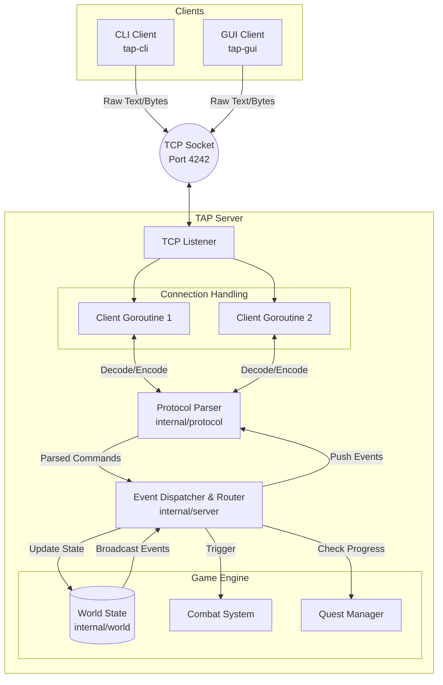

# Architecture

The Answer Protocol (TAP) is built around a robust client-server architecture written in Go, specifically designed to handle concurrent connections and real-time state synchronization over TCP. The core server acts as the single source of truth, employing an event-driven dispatcher to manage player actions, combat, and world state across a shared environment. By isolating responsibilities into distinct modules—such as protocol serialization, world management, and network I/O—the system remains highly maintainable and scalable. This backend seamlessly supports two independent client implementations: a fast, text-based CLI and a richer, interactive GUI.

## System Overview

The system is composed of three primary binaries, all compiled from a single monolithic repository:
1. **Server (`tap-server`)**: The authoritative game server.
2. **CLI Client (`tap-cli`)**: A lightweight, terminal-based interface.
3. **GUI Client (`tap-gui`)**: A graphical user interface offering enhanced accessibility.

### Architecture Diagram

## Server Design

### Concurrency Model
The server leverages Go's native concurrency features (goroutines and channels). Each connected client is handled by a dedicated goroutine that listens for incoming TCP packets. To prevent race conditions when updating the shared world state (e.g., player movement, item drops), all state-modifying actions are channeled into a central game loop or synchronized using mutexes.

### Dispatcher and Router
Incoming commands from clients are parsed and passed to a central command dispatcher. The dispatcher identifies the command type (e.g., `MOVE`, `ATTACK`, `TAKE`) and routes the payload to the appropriate handler within the game engine.

### Package Structure
- `cmd/`: Contains the main application entry points for the server, CLI, and GUI.
- `internal/server/`: Houses the core network listener, connection management, and the main game loop.
- `internal/world/`: Manages the static world data (loaded from YAML), rooms, NPCs, items, and dynamic state changes.
- `internal/protocol/`: Implements the RFC 42TAP specifications, handling ABNF syntax parsing, error code generation, and message serialization/deserialization.

## Client Architecture

Both the CLI and GUI clients act as thin interfaces. They maintain an active TCP connection to the server, forward user inputs formatted according to the TAP protocol, and asynchronously listen for broadcasted events (such as other players entering a room or combat updates). The GUI client utilizes a dedicated toolkit to render these events visually, parsing the server's structured responses to update local interface elements in real-time.
