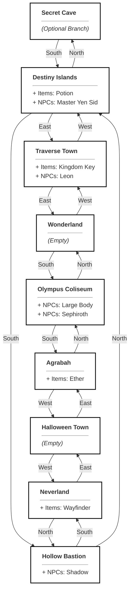

# World Design

The game world in The Answer Protocol is meticulously designed as a fully interconnected, non-linear environment that encourages deep exploration and cooperative gameplay. Moving away from simple linear paths, the layout features a central hub with branching loops and secret optional areas, ensuring players can freely traverse the world without hitting dead ends. This rich environment is populated by a diverse cast of NPCs—ranging from helpful dialogue characters and quest-givers to hostile enemies—and is scattered with unique items to discover, collect, and use. The deliberate distribution of these elements not only breathes life into the world but also seamlessly integrates with our dynamic combat and questing systems.

This document provides a comprehensive overview of the game world, including room connections, item distribution, NPCs, and available quests.

## Map Overview

The map consists of an 8-room loop, allowing continuous exploration, with one optional branch leading to the Secret Cave. 

## NPCs

| NPC ID | Name | Role | Location | Description | Stats |
| :--- | :--- | :--- | :--- | :--- | :--- |
| `yen_sid` | Master Yen Sid | Quest Giver | Destiny Islands | A wise and powerful sorcerer, retired Keyblade Master. | - |
| `leon` | Leon | Dialogue | Traverse Town | A stoic warrior wielding a gunblade. | - |
| `shadow_heartless` | Shadow | Enemy | Hollow Bastion | A pureblood Heartless born from the darkness in a heart. | HP: 30, DMG: 10 |
| `large_body` | Large Body | Enemy | Olympus Coliseum | A massive Heartless that blocks attacks with its big belly. | HP: 100, DMG: 25 |
| `sephiroth` | Sephiroth | Enemy | Olympus Coliseum | A legendary SOLDIER with a massive nodachi. | HP: 9999, DMG: 9999 |

## Items

| Item ID | Name | Description | Location |
| :--- | :--- | :--- | :--- |
| `potion` | Potion | A restorative item that heals a small amount of HP. | Destiny Islands |
| `ether` | Ether | An item that restores magic power. | Agrabah |
| `keyblade` | Kingdom Key | A mysterious weapon shaped like a giant key. | Traverse Town |
| `wayfinder` | Wayfinder | A star-shaped charm made of thalassa shells. | Neverland |

## Quests

| Quest ID | Name | Type | Target | Reward | Given By |
| :--- | :--- | :--- | :--- | :--- | :--- |
| `find_wayfinder` | Bonds of Friendship | Fetch | `wayfinder` | You feel your heart grow stronger. | Master Yen Sid |
| `defeat_shadow` | Push Back the Darkness | Defeat | `shadow_heartless` | You gained valuable combat experience. | Master Yen Sid |

## Minimum Requirements Met

Our static world data successfully fulfils all the mandatory subject requirements to create a robust game environment:

- **At least 8 interconnected rooms forming loops with at least one optional branch:** The map consists of an 8-room central loop (`Destiny Islands`, `Traverse Town`, `Wonderland`, `Olympus Coliseum`, `Agrabah`, `Halloween Town`, `Neverland`, `Hollow Bastion`) with one optional branch leading to the `Secret Cave`.
- **Movement allows full circuit exploration (no "line-only" maps):** The core 8 rooms form a continuous, bi-directional loop, meaning players are never forced into dead-ends on the main path.
- **At least 3 distinct NPC roles:** We have Quest Givers (`Master Yen Sid`), Dialogue NPCs (`Leon`), and Enemy NPCs (`Shadow`, `Large Body`, `Sephiroth`).
- **At least 4 distinct items with at least 2 obtainable in-world:** We defined 4 items (`potion`, `ether`, `keyblade`, `wayfinder`), all of which are mapped directly to rooms where players can pick them up.
- **At least 2 implemented quests of different types:** We implemented a Fetch quest (`find_wayfinder`) and a Defeat/Combat quest (`defeat_shadow`).
- **All NPCs and items referenced in rooms are properly defined in world data:** All entities spawned in the rooms (e.g., Potion, Leon, Shadow) are thoroughly defined in the NPC and Items tables to prevent parsing errors.
