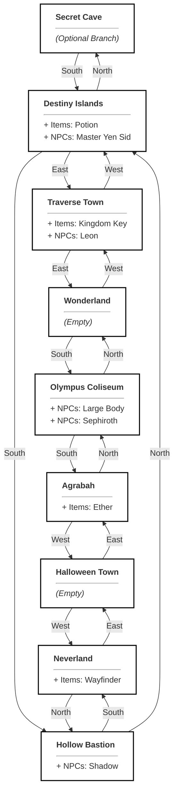

# World Design

This document provides a comprehensive overview of the game world, including room connections, item distribution, NPCs, and available quests.

## Map Overview

The map consists of an 8-room loop, allowing continuous exploration, with one optional branch leading to the Secret Cave. 

## NPCs

| NPC ID | Name | Role | Location | Description | Stats |
| :--- | :--- | :--- | :--- | :--- | :--- |
| `yen_sid` | Master Yen Sid | Quest Giver | Destiny Islands | A wise and powerful sorcerer, retired Keyblade Master. | - |
| `leon` | Leon | Dialogue | Traverse Town | A stoic warrior wielding a gunblade. | - |
| `shadow_heartless` | Shadow | Enemy | Hollow Bastion | A pureblood Heartless born from the darkness in a heart. | HP: 30, DMG: 10 |
| `large_body` | Large Body | Enemy | Olympus Coliseum | A massive Heartless that blocks attacks with its big belly. | HP: 100, DMG: 25 |
| `sephiroth` | Sephiroth | Enemy | Olympus Coliseum | A legendary SOLDIER with a massive nodachi. | HP: 9999, DMG: 9999 |

## Items

| Item ID | Name | Description | Location |
| :--- | :--- | :--- | :--- |
| `potion` | Potion | A restorative item that heals a small amount of HP. | Destiny Islands |
| `ether` | Ether | An item that restores magic power. | Agrabah |
| `keyblade` | Kingdom Key | A mysterious weapon shaped like a giant key. | Traverse Town |
| `wayfinder` | Wayfinder | A star-shaped charm made of thalassa shells. | Neverland |

## Quests

| Quest ID | Name | Type | Target | Reward | Given By |
| :--- | :--- | :--- | :--- | :--- | :--- |
| `find_wayfinder` | Bonds of Friendship | Fetch | `wayfinder` | You feel your heart grow stronger. | Master Yen Sid |
| `defeat_shadow` | Push Back the Darkness | Defeat | `shadow_heartless` | You gained valuable combat experience. | Master Yen Sid |
